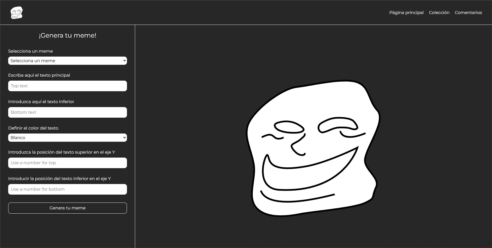

# Generador de Memes

## Descripción
Generador de memes con Flask. Esta aplicación permite a los usuarios seleccionar imágenes y agregar texto personalizado para crear memes (algo simple).

## Instalación
Para instalar las dependencias necesarias, asegúrate de tener Python y pip instalados. Luego, ejecuta el siguiente comando en tu terminal:

```bash
pip install Flask Flask-Cors
```


## Uso
Para ejecutar la aplicación, utiliza el siguiente comando:

```bash
python main.py
```

Luego, abre tu navegador y ve a `http://127.0.0.1:5000` para acceder a la aplicación.

## Captura de Pantalla
  
## Notas
- Si encuentras errores en el HTML, es debido a cosas de HTML.
- La aplicación funciona como se espera 👍🏻.
